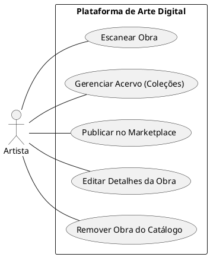

```plantuml
@startuml
left to right direction

actor "Artista" as A1

rectangle "Plataforma de Arte Digital" {
    usecase "Escanear Obra" as UC3
    usecase "Gerenciar Acervo (Coleções)" as UC4
    usecase "Publicar no Marketplace" as UC6
    usecase "Editar Detalhes da Obra" as UC7
    usecase "Remover Obra do Catálogo" as UC8
}

' Relacionamentos do Artista
A1 -- UC3
A1 -- UC4
A1 -- UC6
A1 -- UC7
A1 -- UC8

@enduml
```